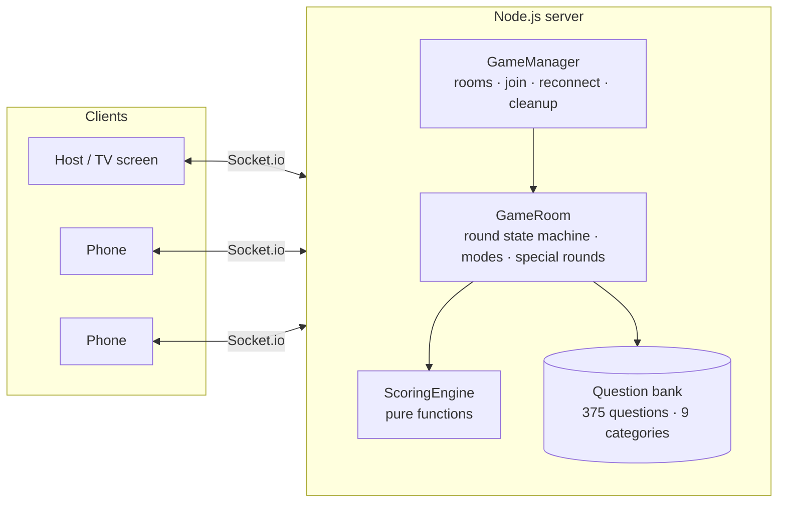

# Trivia Party — "Neon Arena"

**A real-time multiplayer party game in the style of Kahoot and Jackbox.** One screen hosts, everyone else plays from their phone — no app install, no account. Five game modes, two of them in 3D, fully bilingual (Arabic RTL / English), and it runs completely offline on a local Wi-Fi network.

[العربية](./README.ar.md)

<!-- TODO: add gameplay GIF here:  -->

---

## Highlights

- **Server-authoritative game loop** — the timer, answer checking and scoring all run on the server. The correct answer is never sent to clients before the question ends, so the browser can't be used to cheat.
- **Clock synchronisation** — clients estimate their offset from the server clock (NTP-style, averaged over several round trips) so countdowns stay in sync across phones with different latency.
- **Reconnection without losing state** — a player who drops (phone locks, Wi-Fi blips) can rejoin within 60 seconds with their score, streak and power-ups intact, using a session token.
- **Five game modes on one state machine** — Classic, Teams, Survival (elimination), Race (3D track with rockets / shields / nitro) and Chase (one chaser vs. everyone in a 3D escape tunnel).
- **Zero external assets** — all sound and music are synthesised live with the WebAudio API, the 20 animated avatars are hand-built SVG, and fonts and icons are bundled. No CDN, no audio files.
- **No frontend framework** — plain JavaScript and hand-written CSS, with four switchable party themes.

## Architecture



**Round state machine** (runs on the server, one per room):

```
LOBBY → STARTING → QUESTION_ACTIVE → REVEAL → LEADERBOARD ─┐
          ↑                                                │ (depends on mode)
          └──────────────── rematch ◄─── GAME_END ◄────────┘
                                   ▲
                    TIEBREAKER_INTRO → QUESTION_ACTIVE
```

**Scoring** (`server/ScoringEngine.js`, pure functions):

```
base   = max(100, round(1000 × timeRemaining / totalTime))
ranked = base × max(0.85, 1 − rank × 0.03)
final  = round(ranked × difficultyMultiplier × streakMultiplier)
```

## Game modes

| Mode | How it works | Ends when |
|---|---|---|
| **Classic** | Speed-based points, with a double-points golden question and a surprise "buzzer" round | All rounds are played |
| **Teams** | Red vs. Blue; a team tie is decided by a duel between each team's best player | All rounds are played |
| **Survival** | The lowest score is eliminated every N questions | One player is left |
| **Race** | 3D track, one car per player; correct answers earn rockets, shields and nitro | Everyone crosses the finish line |
| **Chase** | One chaser vs. everyone; a red wall advances on the chaser's correct answers while runners climb to the safe gate | Every runner is safe or caught |

Shared across modes: **guess rounds** (closest number wins), **tiebreaker duels**, live **emoji reactions**, power-ups (50/50, freeze time, double points, steal points), end-of-game **awards**, and a **stage display mode** that turns the host device into a TV show screen while phones become giant answer buttons.

## Tech stack

| Layer | Technology |
|---|---|
| Server | Node.js, Express 5, Socket.io 4 |
| Frontend | Vanilla JavaScript, hand-written CSS (no framework) |
| Real-time | WebSockets with client↔server clock-offset estimation |
| Audio | WebAudio API (procedural sound, no files) + Web Speech API question reader |
| i18n | Arabic (RTL) and English |
| Deploy | Docker, Fly.io |

## Run locally

Requires Node.js 18+.

```bash
npm install
npm start
```

The server prints a LAN address such as `http://192.168.1.15:3000`. Open it on the host device and create a room; friends on the same Wi-Fi scan the QR code to join.

| Env var | Default | Purpose |
|---|---|---|
| `PORT` | `3000` | HTTP port |
| `PUBLIC_URL` | LAN address | Base URL used in join links and QR codes (set this when deployed) |

## Deploy

The game keeps room state in memory, so it runs as a **single instance**.

```bash
fly launch --copy-config --no-deploy   # first time only
fly deploy
```

Or with Docker anywhere:

```bash
docker build -t trivia-party .
docker run -p 3000:3000 -e PUBLIC_URL=https://your-domain trivia-party
```

## Project structure

```
server/
  index.js          Express + Socket.io entry point, event routing
  GameManager.js    Room lifecycle: create, join, reconnect, cleanup
  GameRoom.js       Round state machine, game modes, special rounds, awards
  Player.js         Player model (score, streak, power-ups, team, race items)
  ScoringEngine.js  Scoring formulas (pure functions)
  questions/        Question bank split into packs (general / football / guess)
public/
  js/screens/       home, lobby, question, reveal, leaderboard, gameover
  js/sound.js       Procedural audio engine + question reader
  js/avatars.js     20 animated SVG characters + race cars
  css/              Design system, themes, race and chase scenes
```

## License

MIT
